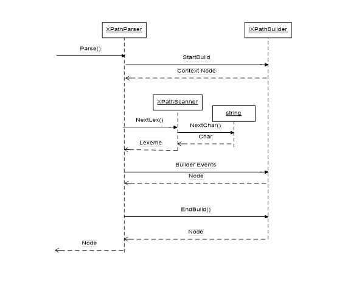

# XPathParser: XPath parser in C# source code.
[](https://ci.appveyor.com/project/qmfrederik/xpathparser)

Close to one System.Xml uses in the XslCompiledTransform.
Currently supports XPath 1.0 grammar.

This implementation uses _Builder_ pattern to separate parsing code from result the parser should produce. 

While parsing the source XPath parser calls method in the methods of `IXPathBuilder` interface provided by caller.

User of this code expected to write his own `IXPathBuilder` implementation.
Source code of this project contains two `IXPathBuilder` implementations for demo/testing purpose:
* `XPathTreeBuilder` - constructs XLinq tree that represents XPath syntax tree.
* `XPathStringBuilder` - compiles syntax tree back to XPaht string.

## Installation

Install using the command line:

```
Install-Package XPathParser
```

## Architecture
XPath is a language to query data from XML documents. It is built in to XSLT and can be used standalone in several .NET APIs. (http://www.w3.org/TR/xpath)
In some cases customers need to parse XPath expressions themselves to analyze, modify or validate them. 
`XPathParser` is the class that can help you doing this.

To make parser extensible `XPathParser` uses "Builder" pattern. It takes string with XPath expression and instance of `IXPathBuilder` interface (builder) as input and generates set of calls to the builder. 

This way implementation of the `XPathParser` doesn't dictate how parsed expression would be represented.

With the `XPathParser` we provide `XPathParserTest` that contains two sample implements of the `IXPathBuilder`: `XPathTreeBuilder` which builds XLinq tree as a result of parsing and `XPathStringBuilder` that generates string implementation of the compiled XPath.

The work of `XPathParser` can be demonstrated in the following diagram:



## Examples

### Expression "1 + 2":
```
ctx = StartBuild();
return EndBuild(Operator(XPathOperator.Plus, Number(1), Number(2)))
```

### Expression "a/@*":

```
ctx = StartBuild();
stp1 = Axis(ctx, XPathAxis.Child, QilXmlNodeKind.Element, "", "a");
stp2 = Axis(stp1, XPathAxis.Attribute, QilXmlNodeKind.Attribute, "", "");
return EndBuild(JoinStep(stp1, stp2));
```

### Expression "parent:a[@b]":

ctx = StartBuild();
stp1 = Axis(ctx, XPathAxis.Parent, QilXmlNodeKind.Element, "", "a");
stp2 = Axis(stp1, XPathAxis.Attribute, QilXmlNodeKind.Attribute, "", "b");
return EndBuild(Predicate(stp1, stp2));

## Credits
This repository was forked from http://xpathparser.codeplex.com/